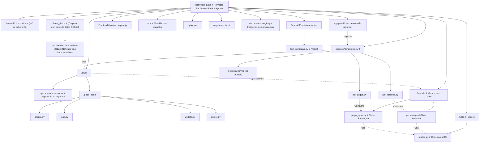
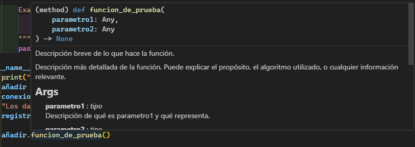

# proyecto_agua
This is my first project with new tecnologies and git !!

# Lee la documentacion para instalar el proyecto

# Before the create

You need create a virtual ent (env), for work with flask 

# Project structure 



## Generar una clave secreta SECRET_KEY

### Reglas de oro

Nunca la compartas: No la subas a GitHub o chats públicos.
Usa una por proyecto: No reutilices claves.
En producción:
Génerala con openssl o secrets.
Almacénala en variables de entorno del servidor (no en el código).


# Descripcion

Este el el proyecto de Gestion comunal SG mandho el cual consta de 2 bases principales, backend y frontend
Tenemos por una parte python y flask para backend y astro, con alpine.js para frontend

El lenguaje estructurado a objetos es python, y la base de datos por el momento es SQLite

La estructuras de carpetas del backend se muestra aqui, sin embargo las estructura del front se muestra en su propio README.md (En la carpeta frontend).


## Documentacion backend
Aunque ya tenemos la estructura de carpetas tenemos los docstring los cuales docuemntan cada una de las funciones ejemplo

```python
    def funcion_de_prueba(self, parametro1, parametro2):
        """Descripción breve de lo que hace la función.

        Descripción más detallada de la función. Puede explicar el propósito,
        el algoritmo utilizado, o cualquier información relevante.

        Args:
            parametro1 (tipo): Descripción de qué es parametro1 y qué representa.
            parametro2 (tipo): Descripción de qué es parametro2 y qué representa.

        Returns:
            tipo: Descripción de lo que retorna la función. Si no retorna nada, se puede omitir
            o poner "None".

        Raises:
            TipoError: Descripción de bajo qué condiciones se lanza este error.

        Examples:
            >>> funcion_de_prueba(valor1, valor2)
            resultado_esperado
        """
        pass
```
y despues cuando mandas a llamar a esta funcion, se ve el docstring de esta forma:



Ademas cada fichero tendra una descripcion de que es lo que se hace en cada uno 

```python
class Hola Mundo
  """
  En esta clase se conecta con la base de datos mediante este metodo, utiliza estas propiedades,
  tiene estos atributos etc etc
  """
```