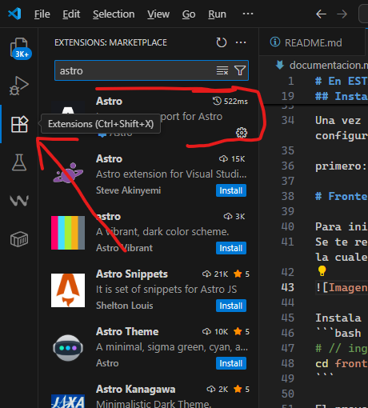
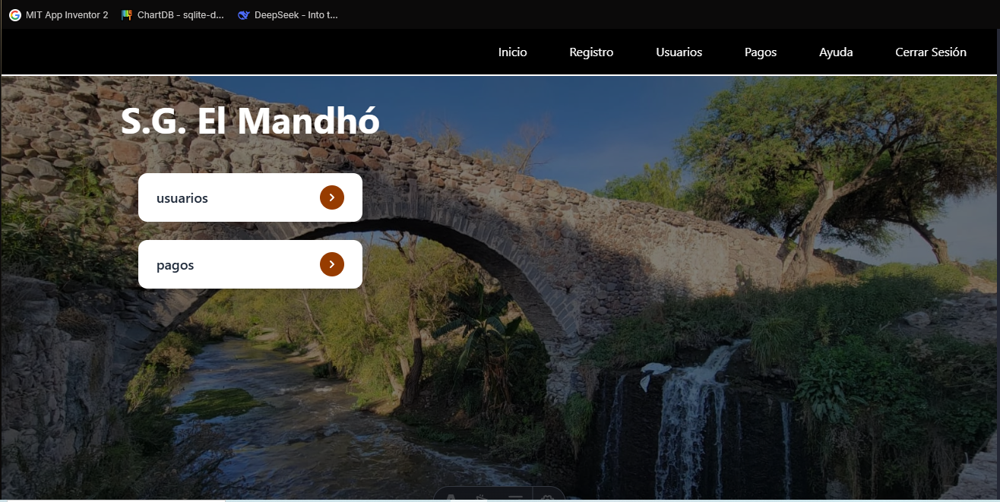

# DOCUMENTACIÓN COMPLETA DE INSTALACIÓN DEL PROYECTO
---
## 📋 PRE-REQUISITOS
### Herramientas necesarias:
1.  **Git** - Sistema de control de versiones
    🔗 Descarga: [https://git-scm.com/downloads](https://git-scm.com/downloads)
    📌 *Necesario para clonar el repositorio*
2.  **Python 3.8+** - Para el backend
    🔗 Descarga: [https://www.python.org/downloads/](https://www.python.org/downloads/)
    📌 *Asegúrate de marcar "Add Python to PATH" durante la instalación*
3.  **Node.js 16+** - Para el frontend
    🔗 Descarga: [https://nodejs.org/](https://nodejs.org/)
    📌 *Recomendada la versión LTS*
4.  **pnpm** - Gestor de paquetes
    ```bash
    npm install -g pnpm
    ```

### Verificación de instalaciones:
```bash
# Compruebas que los componentes funcionen con:
python -v
pnpm -v
git -v
```

## Instalacion con git:
Primero debes de acceder al CMD. Busca en el buscador de windows 10, y escribe cmd para abrir la terminal, una vez ahi navega a la carpeta deseada con:
---
## 🛠️ INSTALACIÓN DEL PROYECTO
1.  ### Clonar el repositorio

    ```
    # Navega a tu directorio de trabajo
    cd ~/Desktop  # o cualquier otra ubicación

    # Clona el repositorio
    git clone [https://github.com/luidev-ddtr/](https://github.com/tu-usuario/tu-repositorio.git)

    # Accede al directorio del proyecto
    cd tu-repositorio
    ```

---
## 🖥️ CONFIGURACIÓN DEL FRONTEND
1.  ### Preparar el entorno

    ```
    # Accede a la carpeta del frontend
    cd frontend

    # Instala las dependencias
    pnpm install
    ```

2.  ### Extensiones recomendadas para VSCode
    * Astro Official Extension
    * ESLint
    * Prettier - Code formatter
    * Alpine.js IntelliSense

    

3.  ### Ejecutar el servidor de desarrollo

    ```
    pnpm run dev
    ```

    🔹 El servidor se iniciará en: <http://localhost:4321>
    🔹 Hot Reload: Los cambios se verán automáticamente

---
## 🚨 ADVERTENCIAS IMPORTANTES
<div style="color: red; background: #ffeeee; padding: 10px; border-left: 3px solid red; margin: 10px 0;">
    <strong>ZONAS RESTRINGIDAS - NO MODIFICAR:</strong>
    <ul>
        <li><code>src/config/</code> - Archivos de configuración crítica</li>
        <li><code>src/components/core/</code> - Componentes base del sistema</li>
        <li>Cualquier archivo <code>.env</code> - Variables de entorno</li>
        <li><code>astro.config.mjs</code> - Configuración del proyecto</li>
    </ul>
    <strong>ZONAS SEGURAS PARA MODIFICAR:</strong>
    <ul>
        <li><code>public/</code> - Para imágenes y assets</li>
        <li><code>src/components/ui/</code> - Componentes de interfaz</li>
        <li><code>src/pages/</code> - Páginas del sistema</li>
    </ul>
</div>

4.  ### Estructura esperada al iniciar
    

---
## ⚙️ CONFIGURACIÓN DEL BACKEND
1.  ### Preparar el entorno

    ```
    # Regresa a la raíz del proyecto
    cd ..

    # Accede a la carpeta del backend
    cd backend

    # Crear entorno virtual (Windows)
    python -m venv venv
    .\venv\Scripts\activate

    # Instalar dependencias
    pip install -r requirements.txt
    ```

2.  ### Configuración inicial
    el proyecto ya tiene las configuraciones correctas 

3.  ### Ejecutar el servidor

    ```
    python app.py
    ```

---
## 📌 TROUBLESHOOTING
### Problemas comunes:
* ### Errores de instalación:

    ```
    # Limpiar cache y reinstalar
    pnpm cache clean
    pnpm install
    ```

* ### Puertos ocupados:

    ```
    # Para frontend (4321)
    pnpm run dev --port 3000


    python app.py
    ```

* ### Problemas con Python:
    ```
    # Recrear entorno virtual
    deactivate
    rmdir /s venv
    python -m venv venv
    ```


Con esta pequeña documentacion el pyoyecto ya tendria estaria listo para poder editarse y empezar a trabjar en local 


