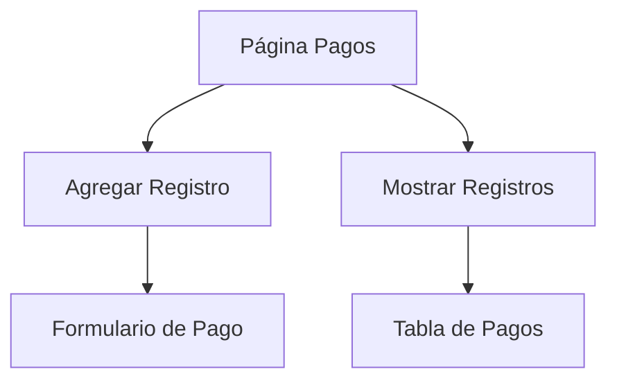

# 📄 Documentación de la Página de Gestión de Pagos

## 🌟 Visión General
Página principal del módulo de pagos que ofrece acceso rápido a las funciones CRUD mediante botones de navegación.

## 🏗 Estructura Básica

```astro
---
// Importaciones
import Layout from "../layouts/Layout.astro";
import FlechaBoton from '../components/FlechaBoton.astro';
const BASE_URL = import.meta.env.VITE_BASE_URL || '';
---
```

Característica	Detalle
Efecto	Superposición oscura (60% opacidad)
Imagen	puente1.webp desde la carpeta public
Posición	Cubre toda la pantalla


## 🧭 Panel de Navegación
'''html
<div class="w-1/2 flex flex-col items-center space-y-6">
  <FlechaBoton texto="Agregar Registro" href="${BASE_URL}/crud/pagos/agregar"/>
  <FlechaBoton texto="Mostrar Registro" href="${BASE_URL}/crud/pagos/listar"/> 
</div>
'''

### 🛠 Componentes Clave
🎯 FlechaBoton
Componente reutilizable que muestra:

Texto descriptivo

Icono de flecha →

Efectos hover

### 🌐 Rutas Disponibles
Botón	Ruta	Descripción
Agregar Registro	/crud/pagos/agregar	Formulario de nuevo pago
Mostrar Registro	/crud/pagos/listar	Tabla de registros existentes




